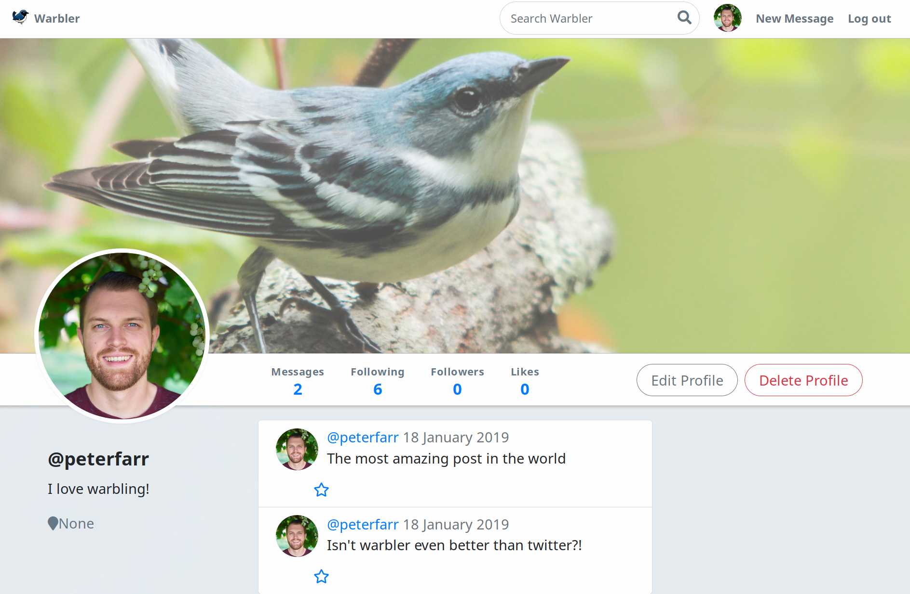

# Warbler
Warbler is a mock twitter clone built completely as a backend application. Users can signup/login, follow other users, be followed by other users, create warbles(similar to tweets), as well as direct message other users. User authentication/authorization is done with bcrypt for verification and sessions are used to store current user information. The backend is built in Flask and Jinja is used as a templating system for the HTML. PostgreSQL is used as the relational database and communicated with via SQLAlchemy. Tests are written for the views and models using the unittest module. Feel free to run the app locally or go to the live hosted heroku site: [warbler](https://warbler-pf.herokuapp.com/users/335).

